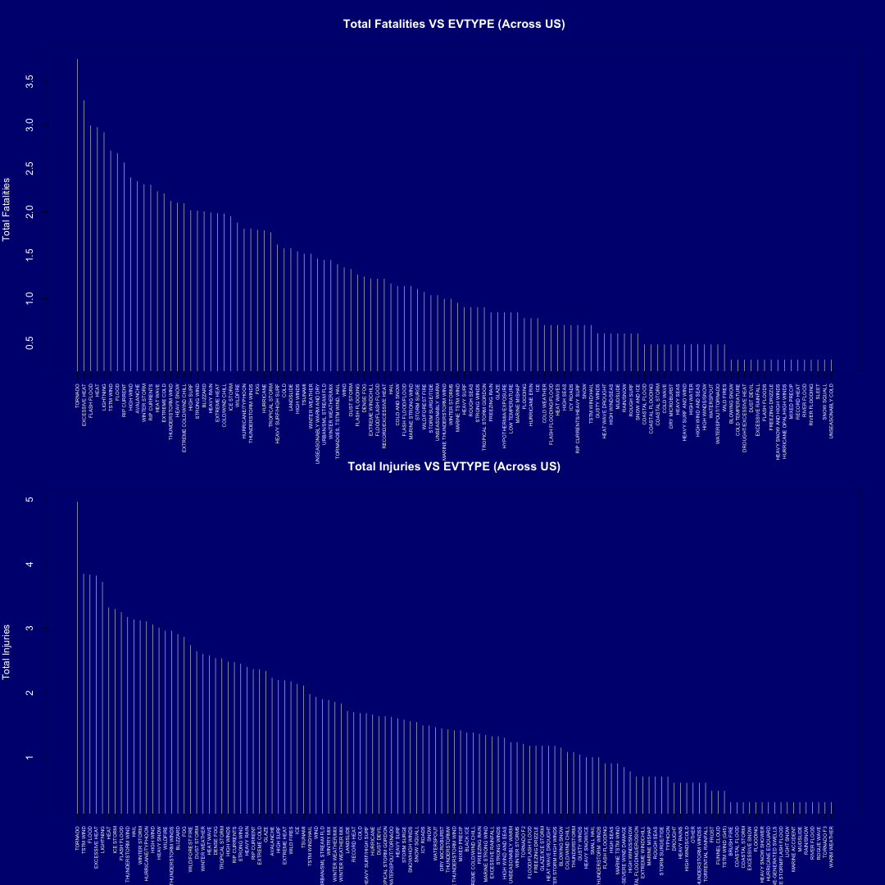
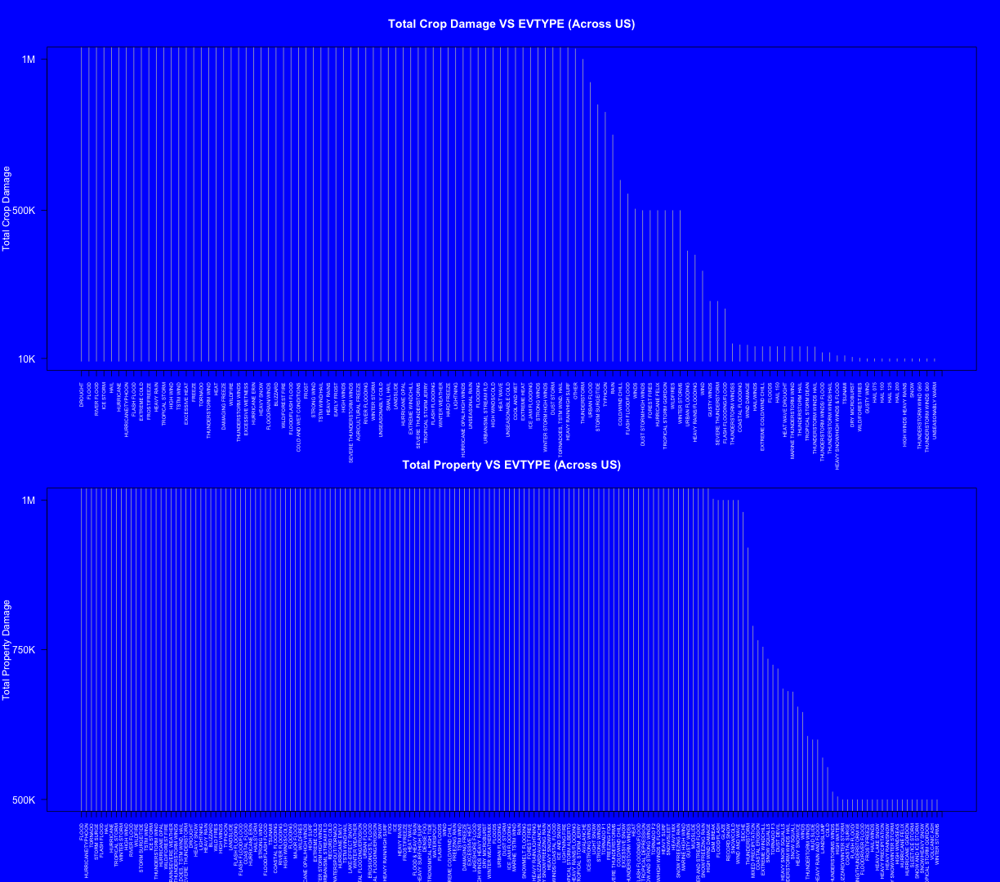

**SHORT REVIEW OF THE MORTALITY RATE AND ECONOMIC LOSS CAUSED DUE TO SEVERE WEATHER EVENTS**
========================================================

**Synopsis:** 
The below report reviews the loss of human life and economic losses sustained due to different types of sever weeather conditions as documented by U.S. National Oceanic and Atmospheric Administration. The analysis deals with the human population loss and economics loss due to these weather events. This analysis is meant to give just a rough idea about the intensity of damage caused and thus many simplifying assumptions are made in the process. Any values going beyond the Y-limits in the second figure are to be be considered over-critical and most dangerous weather events. I should be noted that though data is cleaned due to improper data collection some catergories of weather events are repetative.


All the necessary data processing  in done in the chunk below. The main datasets produced during the process are:

- population_data : Dataset of the damage caused to human life due to various weather events.
- economic_damage : Dataset of the economic damage caused due to various weather events.
- Total_Fatalities : Dataset consisting of the total number of fatalities caused to human life.
- Total_Injuries : Dataset consisting of the total number of injuries caused to human life.
- crop_damage : Dataset consisting of the total monetary loss sustained due to crop loss.
- prop_damage : Dataset consisting of the total monetary loss sustained due to property loss.
- Total_Damage : Dataset consisting of top 100 weather events causing total fatalities, total injuries, total crop damage and total property damage.

*Note:* The .Rmd file and .csv.bz2 data file should be placed in the working directory prior to code execution.


**DATA PRE-PROCESSING**

```r
library(plyr)
mydata <- read.csv("repdata-data-StormData.csv.bz2", header = T, na.strings = "?")

population_data <- mydata[, c(8, 23, 24)]
population_data$EVTYPE <- toupper(population_data$EVTYPE)
population_data <- ddply(population_data, .(EVTYPE), summarize, Total_Fatalities = sum(FATALITIES), 
    Total_Injuries = sum(INJURIES))

economic_damage <- mydata[, c(8, 25, 26, 27, 28)]
economic_damage$EVTYPE <- toupper(economic_damage$EVTYPE)
economic_damage$CROPDMGEXP <- toupper(economic_damage$CROPDMGEXP)
economic_damage$PROPDMGEXP <- toupper(economic_damage$PROPDMGEXP)

Total_Fatalities <- population_data[population_data$Total_Fatalities != 0, c(1, 
    2)]
Total_Fatalities <- Total_Fatalities[order(Total_Fatalities$Total_Fatalities, 
    decreasing = T), ]
Total_Fatalities$Total_Fatalities <- log10(Total_Fatalities$Total_Fatalities)
Total_Fatalities <- Total_Fatalities[Total_Fatalities$Total_Fatalities != 0, 
    ]

Total_Injuries <- population_data[population_data$Total_Injuries != 0, c(1, 
    3)]
Total_Injuries <- Total_Injuries[order(Total_Injuries$Total_Injuries, decreasing = T), 
    ]
Total_Injuries$Total_Injuries <- log10(Total_Injuries$Total_Injuries)
Total_Injuries <- Total_Injuries[Total_Injuries$Total_Injuries != 0, ]

## For crop damage anything below 10000 is considered insignificant.
crop_damage <- economic_damage[economic_damage$CROPDMGEXP == "M" | economic_damage$CROPDMGEXP == 
    "K" | economic_damage$CROPDMGEXP == "B", c(1, 4, 5)]
crop_damage <- crop_damage[crop_damage$CROPDMG != 0, ]
crop_damage$CROPDMGEXP <- gsub("M", replacement = "1000000", crop_damage$CROPDMGEXP)
crop_damage$CROPDMGEXP <- gsub("K", replacement = "1000", crop_damage$CROPDMGEXP)
crop_damage$CROPDMGEXP <- gsub("B", replacement = "1000000000", crop_damage$CROPDMGEXP)
crop_damage$CROPDMGEXP <- as.numeric(crop_damage$CROPDMGEXP)
crop_damage$CROPDMG_CROPDMGEXP <- crop_damage$CROPDMG * crop_damage$CROPDMGEXP
crop_damage <- ddply(crop_damage, .(EVTYPE), summarize, Total_Crop_Damage = sum(CROPDMG_CROPDMGEXP))
crop_damage <- crop_damage[order(crop_damage$Total_Crop_Damage, decreasing = T), 
    ]
crop_damage <- crop_damage[crop_damage$Total_Crop_Damage >= 10000, ]

## For property damage anything less than 5,00,000 is considered
## insignificant.
prop_damage <- economic_damage[economic_damage$PROPDMGEXP == "M" | economic_damage$PROPDMGEXP == 
    "K" | economic_damage$PROPDMGEXP == "B" | economic_damage$PROPDMGEXP == 
    "H", c(1, 2, 3)]
prop_damage <- prop_damage[prop_damage$PROPDMG != 0, ]
prop_damage$PROPDMGEXP <- gsub("M", replacement = "1000000", prop_damage$PROPDMGEXP)
prop_damage$PROPDMGEXP <- gsub("K", replacement = "1000", prop_damage$PROPDMGEXP)
prop_damage$PROPDMGEXP <- gsub("B", replacement = "1000000000", prop_damage$PROPDMGEXP)
prop_damage$PROPDMGEXP <- gsub("H", replacement = "100", prop_damage$PROPDMGEXP)
prop_damage$PROPDMGEXP <- as.numeric(prop_damage$PROPDMGEXP)
prop_damage$PROPDMG_PROPDMGEXP <- prop_damage$PROPDMG * prop_damage$PROPDMGEXP
prop_damage <- ddply(prop_damage, .(EVTYPE), summarize, Total_prop_damage = sum(PROPDMG_PROPDMGEXP))
prop_damage <- prop_damage[order(prop_damage$Total_prop_damage, decreasing = T), 
    ]
prop_damage <- prop_damage[prop_damage$Total_prop_damage >= 5e+05, ]
```


**ANALYSIS AND PLOTS**
The below figures are completely self-explanatory and all conclusions can be drawn by visualization.

Fig 1 represents an histogram for total fatalities caused and total injuries caused throughtout United States in decreasing order for the most damaging weather events. The Y-axis represents Log of the original values for better representation purposes. 


```r

par(mfrow = c(2, 1), bg = "navy", col.axis = "white", col.lab = "white", col.main = "white", 
    col.sub = "black", lend = 1, mar = c(6, 4, 4, 2))
plot(Total_Fatalities$Total_Fatalities, type = "h", xaxt = "n", col = "gray", 
    xlab = "", main = "Total Fatalities VS EVTYPE (Across US)", ylab = "Total Fatalities")
axis(side = 1, at = c(1:nrow(Total_Fatalities)), labels = Total_Fatalities$EVTYPE, 
    las = 2, cex.axis = 0.5)
plot(Total_Injuries$Total_Injuries, type = "h", xaxt = "n", col = "gray", xlab = "", 
    ylab = "Total Injuries", main = "Total Injuries VS EVTYPE (Across US)")
axis(side = 1, at = c(1:nrow(Total_Injuries)), labels = Total_Injuries$EVTYPE, 
    las = 2, cex.axis = 0.5)
```

 


Fig 2 represents the property and crop damage caused to due to various severe weather events.


```r
par(mfrow = c(2, 1), bg = "blue", col.axis = "white", col.lab = "white", col.main = "white", 
    col.sub = "black", lend = 1, mar = c(6, 4, 4, 2))
plot(crop_damage$Total_Crop_Damage, type = "h", xaxt = "n", yaxt = "n", col = "gray", 
    xlab = "", main = "Total Crop Damage VS EVTYPE (Across US)", ylab = "Total Crop Damage", 
    ylim = c(10000, 1e+06))
axis(side = 1, at = c(1:nrow(crop_damage)), labels = crop_damage$EVTYPE, las = 2, 
    cex.axis = 0.5)
axis(side = 2, at = c(10000, 5e+05, 1e+06), labels = c("10K", "500K", "1M"), 
    las = 2)
plot(prop_damage$Total_prop_damage, type = "h", xaxt = "n", yaxt = "n", col = "gray", 
    xlab = "", ylab = "Total Property Damage", main = "Total Property VS EVTYPE (Across US)", 
    ylim = c(5e+05, 1e+06))
axis(side = 1, at = c(1:nrow(prop_damage)), labels = prop_damage$EVTYPE, las = 2, 
    cex.axis = 0.5)
axis(side = 2, at = c(5e+05, 750000, 1e+06), labels = c("500K", "750K", "1M"), 
    las = 2)
```

 


**RESULTS**
The below Table represents the top 100 events causing maximum damage in their respective categories. The total fatalities and total injuries account for damage to human population while crop damage and property damage account for economic loss.


```r
Total_Damage <- data.frame(Total_Fatalities$EVTYPE[1:100], Total_Injuries$EVTYPE[1:100], 
    crop_damage$EVTYPE[1:100], prop_damage$EVTYPE[1:100])
names(Total_Damage) <- c("EVTYPE (Total Fatalities)", "EVTYPE (Total Injuries)", 
    "EVTYPE (Total Crop Damage)", "EVTYPE (Total Property Damage)")
Total_Damage
```

```
##      EVTYPE (Total Fatalities)  EVTYPE (Total Injuries)
## 1                      TORNADO                  TORNADO
## 2               EXCESSIVE HEAT                TSTM WIND
## 3                  FLASH FLOOD                    FLOOD
## 4                         HEAT           EXCESSIVE HEAT
## 5                    LIGHTNING                LIGHTNING
## 6                    TSTM WIND                     HEAT
## 7                        FLOOD                ICE STORM
## 8                  RIP CURRENT              FLASH FLOOD
## 9                    HIGH WIND        THUNDERSTORM WIND
## 10                   AVALANCHE                     HAIL
## 11                WINTER STORM             WINTER STORM
## 12                RIP CURRENTS        HURRICANE/TYPHOON
## 13                   HEAT WAVE                HIGH WIND
## 14                EXTREME COLD               HEAVY SNOW
## 15           THUNDERSTORM WIND                 WILDFIRE
## 16                  HEAVY SNOW       THUNDERSTORM WINDS
## 17     EXTREME COLD/WIND CHILL                 BLIZZARD
## 18                   HIGH SURF                      FOG
## 19                 STRONG WIND         WILD/FOREST FIRE
## 20                    BLIZZARD               DUST STORM
## 21                  HEAVY RAIN           WINTER WEATHER
## 22                EXTREME HEAT                HEAT WAVE
## 23             COLD/WIND CHILL                DENSE FOG
## 24                   ICE STORM           TROPICAL STORM
## 25                    WILDFIRE               HIGH WINDS
## 26           HURRICANE/TYPHOON             RIP CURRENTS
## 27          THUNDERSTORM WINDS              STRONG WIND
## 28                         FOG               HEAVY RAIN
## 29                   HURRICANE              RIP CURRENT
## 30              TROPICAL STORM             EXTREME COLD
## 31        HEAVY SURF/HIGH SURF                    GLAZE
## 32                        COLD                AVALANCHE
## 33                   LANDSLIDE                HIGH SURF
## 34                  HIGH WINDS             EXTREME HEAT
## 35                     TSUNAMI               WILD FIRES
## 36              WINTER WEATHER                      ICE
## 37   UNSEASONABLY WARM AND DRY                  TSUNAMI
## 38        URBAN/SML STREAM FLD           TSTM WIND/HAIL
## 39          WINTER WEATHER/MIX                     WIND
## 40  TORNADOES, TSTM WIND, HAIL     URBAN/SML STREAM FLD
## 41                        WIND               WINTRY MIX
## 42                  DUST STORM       WINTER WEATHER/MIX
## 43              FLASH FLOODING       WINTER WEATHER MIX
## 44                   DENSE FOG                LANDSLIDE
## 45           EXTREME WINDCHILL              RECORD HEAT
## 46           FLOOD/FLASH FLOOD                     COLD
## 47       RECORD/EXCESSIVE HEAT     HEAVY SURF/HIGH SURF
## 48                        HAIL                HURRICANE
## 49               COLD AND SNOW               DUST DEVIL
## 50           FLASH FLOOD/FLOOD    TROPICAL STORM GORDON
## 51          MARINE STRONG WIND       WATERSPOUT/TORNADO
## 52                 STORM SURGE               HEAVY SURF
## 53            WILD/FOREST FIRE              STORM SURGE
## 54            STORM SURGE/TIDE          SNOW/HIGH WINDS
## 55           UNSEASONABLY WARM              SNOW SQUALL
## 56    MARINE THUNDERSTORM WIND                ICY ROADS
## 57               WINTER STORMS                     SNOW
## 58            MARINE TSTM WIND               WATERSPOUT
## 59                  HEAVY SURF           DRY MICROBURST
## 60                  ROUGH SEAS            THUNDERSTORMW
## 61                STRONG WINDS MARINE THUNDERSTORM WIND
## 62       TROPICAL STORM GORDON             MIXED PRECIP
## 63               FREEZING RAIN                BLACK ICE
## 64                       GLAZE  EXTREME COLD/WIND CHILL
## 65        HYPOTHERMIA/EXPOSURE            FREEZING RAIN
## 66             LOW TEMPERATURE       MARINE STRONG WIND
## 67               MARINE MISHAP       EXCESSIVE RAINFALL
## 68                    FLOODING             STRONG WINDS
## 69              HURRICANE ERIN       HIGH WIND AND SEAS
## 70                         ICE        UNSEASONABLY WARM
## 71                COLD WEATHER            WINTER STORMS
## 72        FLASH FLOODING/FLOOD               TORNADO F2
## 73                  HEAT WAVES        FLOOD/FLASH FLOOD
## 74                   HIGH SEAS         FREEZING DRIZZLE
## 75                   ICY ROADS          GLAZE/ICE STORM
## 76     RIP CURRENTS/HEAVY SURF        HEAT WAVE DROUGHT
## 77                        SNOW  WINTER STORM HIGH WINDS
## 78              TSTM WIND/HAIL             BLOWING SNOW
## 79                 GUSTY WINDS          COLD/WIND CHILL
## 80           HEAT WAVE DROUGHT             THUNDERSTORM
## 81              HIGH WIND/SEAS              GUSTY WINDS
## 82                    MUDSLIDE           HEAVY SNOW/ICE
## 83                   RAIN/SNOW               SMALL HAIL
## 84                  ROUGH SURF      THUNDERSTORM  WINDS
## 85                SNOW AND ICE           FLASH FLOODING
## 86               COASTAL FLOOD                HIGH SEAS
## 87            COASTAL FLOODING         MARINE TSTM WIND
## 88               COASTAL STORM   NON-SEVERE WIND DAMAGE
## 89                   COLD WAVE          HIGH WINDS/SNOW
## 90              DRY MICROBURST COASTAL FLOODING/EROSION
## 91                  HEAVY SEAS        EXTREME WINDCHILL
## 92         HEAVY SURF AND WIND            MARINE MISHAP
## 93                  HIGH WATER               ROUGH SEAS
## 94          HIGH WIND AND SEAS         STORM SURGE/TIDE
## 95             HIGH WINDS/SNOW                  TYPHOON
## 96                  WATERSPOUT                  DROUGHT
## 97          WATERSPOUT/TORNADO              HEAVY RAINS
## 98                  WILD FIRES          HIGH WINDS/COLD
## 99                BLOWING SNOW                    OTHER
## 100           COLD TEMPERATURE      THUNDERSTORM WINDSS
##     EVTYPE (Total Crop Damage) EVTYPE (Total Property Damage)
## 1                      DROUGHT                          FLOOD
## 2                        FLOOD              HURRICANE/TYPHOON
## 3                  RIVER FLOOD                        TORNADO
## 4                    ICE STORM                    STORM SURGE
## 5                         HAIL                    FLASH FLOOD
## 6                    HURRICANE                           HAIL
## 7            HURRICANE/TYPHOON                      HURRICANE
## 8                  FLASH FLOOD                 TROPICAL STORM
## 9                 EXTREME COLD                   WINTER STORM
## 10                FROST/FREEZE                      HIGH WIND
## 11                  HEAVY RAIN                    RIVER FLOOD
## 12              TROPICAL STORM                       WILDFIRE
## 13                   HIGH WIND               STORM SURGE/TIDE
## 14                   TSTM WIND                      TSTM WIND
## 15              EXCESSIVE HEAT                      ICE STORM
## 16                      FREEZE              THUNDERSTORM WIND
## 17                     TORNADO                 HURRICANE OPAL
## 18           THUNDERSTORM WIND               WILD/FOREST FIRE
## 19                        HEAT      HEAVY RAIN/SEVERE WEATHER
## 20             DAMAGING FREEZE             THUNDERSTORM WINDS
## 21                    WILDFIRE     TORNADOES, TSTM WIND, HAIL
## 22          THUNDERSTORM WINDS            SEVERE THUNDERSTORM
## 23           EXCESSIVE WETNESS                        DROUGHT
## 24              HURRICANE ERIN                     HEAVY SNOW
## 25                  HEAVY SNOW                      LIGHTNING
## 26            FLOOD/RAIN/WINDS                     HEAVY RAIN
## 27                    BLIZZARD                       BLIZZARD
## 28            WILD/FOREST FIRE                     WILD FIRES
## 29           FLOOD/FLASH FLOOD                     HIGH WINDS
## 30     COLD AND WET CONDITIONS                        TYPHOON
## 31                       FROST                      LANDSLIDE
## 32                 STRONG WIND                 FLASH FLOODING
## 33              TSTM WIND/HAIL              FLASH FLOOD/FLOOD
## 34                 HEAVY RAINS                  COASTAL FLOOD
## 35                 EARLY FROST                 HURRICANE ERIN
## 36                  HIGH WINDS                      HAILSTORM
## 37   SEVERE THUNDERSTORM WINDS                    STRONG WIND
## 38         AGRICULTURAL FREEZE              FLOOD/FLASH FLOOD
## 39              RIVER FLOODING                        TSUNAMI
## 40                WINTER STORM               COASTAL FLOODING
## 41           UNSEASONABLY COLD                 RIVER FLOODING
## 42                  SMALL HAIL                HIGH WINDS/COLD
## 43                   LANDSLIDE                       FLOODING
## 44              HURRICANE OPAL                    MAJOR FLOOD
## 45           EXTREME WINDCHILL                      WILDFIRES
## 46        SEVERE THUNDERSTORMS      HURRICANE OPAL/HIGH WINDS
## 47        TROPICAL STORM JERRY                      HIGH SURF
## 48              FLASH FLOODING                   EXTREME COLD
## 49              WINTER WEATHER        WINTER STORM HIGH WINDS
## 50                 HARD FREEZE           URBAN/SML STREAM FLD
## 51                   LIGHTNING                    RECORD COLD
## 52   HURRICANE OPAL/HIGH WINDS             WATERSPOUT/TORNADO
## 53             UNSEASONAL RAIN                HURRICANE EMILY
## 54                    FLOODING                 TSTM WIND/HAIL
## 55        URBAN/SML STREAM FLD               LAKE-EFFECT SNOW
## 56             HIGH WINDS/COLD                 WINTER WEATHER
## 57                   HEAT WAVE       COASTAL FLOODING/EROSION
## 58           UNSEASONABLE COLD                    URBAN FLOOD
## 59                COOL AND WET             EROSION/CSTL FLOOD
## 60                EXTREME HEAT      COASTAL  FLOODING/EROSION
## 61            ICE JAM FLOODING                           SNOW
## 62                STRONG WINDS           HEAVY RAIN/HIGH SURF
## 63     WINTER STORM HIGH WINDS                            FOG
## 64                  DUST STORM                            ICE
## 65  TORNADOES, TSTM WIND, HAIL                    HEAVY RAINS
## 66        HEAVY RAIN/HIGH SURF                   FROST/FREEZE
## 67                       OTHER                      HEAT WAVE
## 68                THUNDERSTORM             FLOOD & HEAVY RAIN
## 69                 URBAN FLOOD           HEAVY SURF/HIGH SURF
## 70            STORM SURGE/TIDE                      DENSE FOG
## 71                     TYPHOON         ASTRONOMICAL HIGH TIDE
## 72                        RAIN                     WATERSPOUT
## 73             COLD/WIND CHILL                   FLASH FLOODS
## 74           FLASH FLOOD/FLOOD                           WIND
## 75                       WINDS        EXTREME COLD/WIND CHILL
## 76       DUST STORM/HIGH WINDS                  FREEZING RAIN
## 77                FOREST FIRES                      TSTM WIND
## 78             HURRICANE FELIX                DAMAGING FREEZE
## 79       TROPICAL STORM GORDON                 EXCESSIVE HEAT
## 80                   WILDFIRES                LAKESHORE FLOOD
## 81               WINTER STORMS         HIGH WINDS HEAVY RAINS
## 82              URBAN FLOODING                 DRY MICROBURST
## 83        HEAVY RAINS/FLOODING             WINTER WEATHER/MIX
## 84                        WIND                         FLOODS
## 85                 GUSTY WINDS                 URBAN FLOODING
## 86         SEVERE THUNDERSTORM                     DUST STORM
## 87        FLASH FLOODING/FLOOD               ICE JAM FLOODING
## 88         THUNDERSTORM WINDSS               MARINE TSTM WIND
## 89            COASTAL FLOODING                           RAIN
## 90                 WIND DAMAGE              SNOWMELT FLOODING
## 91                  HAIL/WINDS                   FOREST FIRES
## 92     EXTREME COLD/WIND CHILL           HEAVY RAIN/LIGHTNING
## 93                      FLOODS  HEAVY SNOW/BLIZZARD/AVALANCHE
## 94                    HAIL 150       HEAVY SNOW/FREEZING RAIN
## 95           HEAT WAVE DROUGHT                 HEAVY SNOWPACK
## 96    MARINE THUNDERSTORM WIND       HIGH WINDS/COASTAL FLOOD
## 97           THUNDERSTORM HAIL                   ICE AND SNOW
## 98         TROPICAL STORM DEAN                 LIGHTNING FIRE
## 99     THUNDERSTORM WINDS HAIL         TROPICAL STORM ALBERTO
## 100  THUNDERSTORM WINDS/ FLOOD           HEAVY RAINS/FLOODING
```


```r
sessionInfo()
```

```
## R version 3.0.3 (2014-03-06)
## Platform: x86_64-apple-darwin10.8.0 (64-bit)
## 
## locale:
## [1] en_US.UTF-8/en_US.UTF-8/en_US.UTF-8/C/en_US.UTF-8/en_US.UTF-8
## 
## attached base packages:
## [1] stats     graphics  grDevices utils     datasets  methods   base     
## 
## other attached packages:
## [1] knitr_1.5
## 
## loaded via a namespace (and not attached):
## [1] digest_0.6.4   evaluate_0.5.3 formatR_0.10   stringr_0.6.2 
## [5] tools_3.0.3
```

